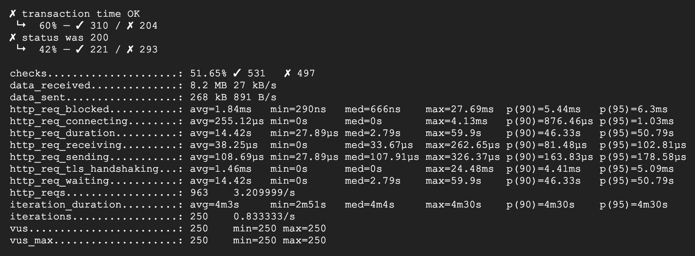
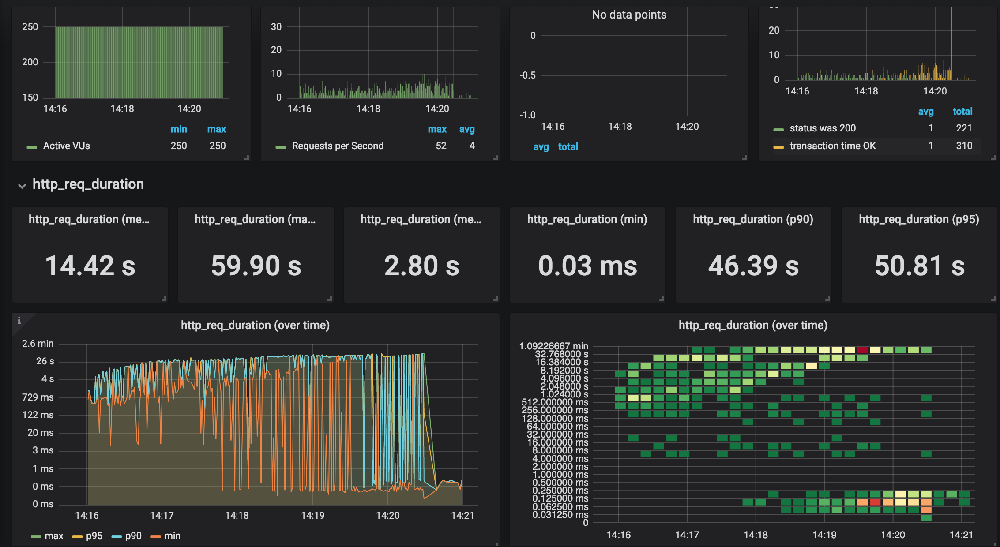
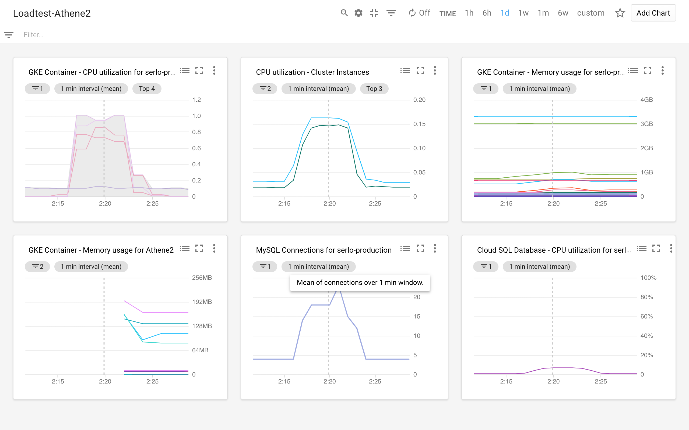
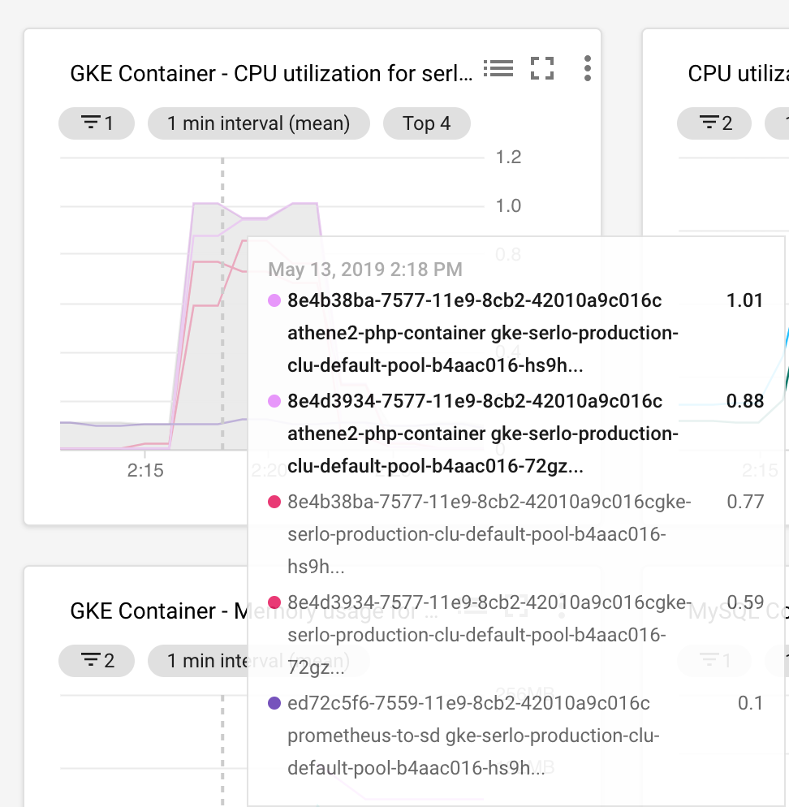
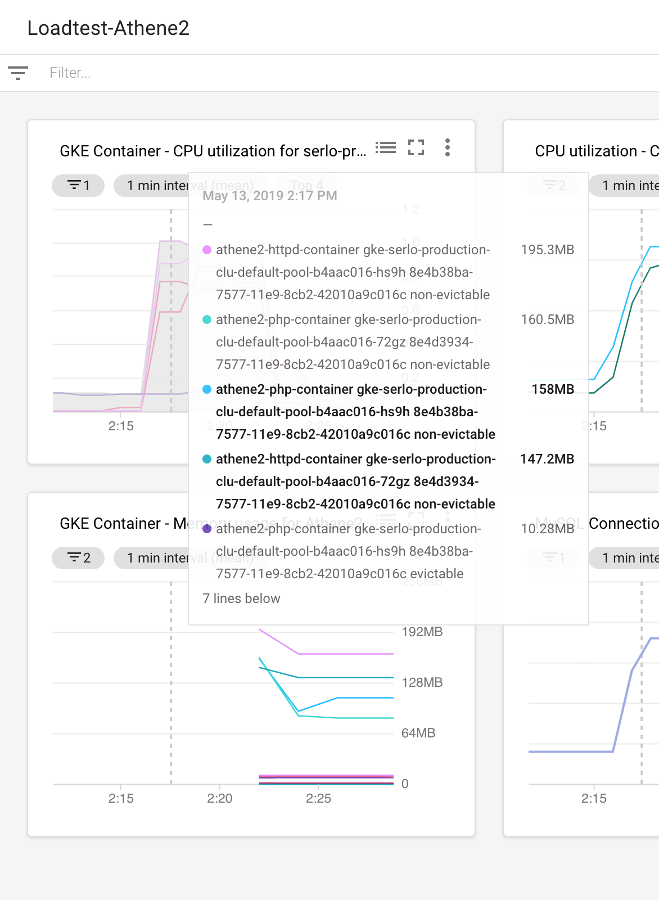
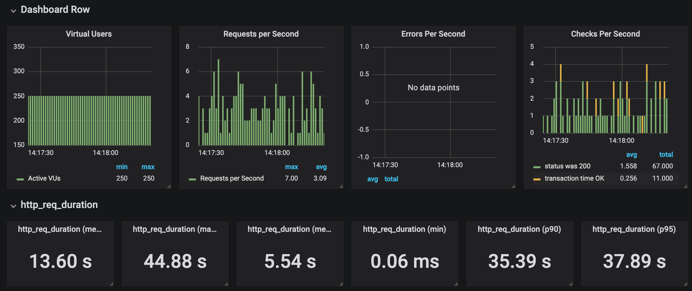

# Result test 1 (2019-05-13 02:16)
## Scenario
```
const vus = 250;
const average_sessions_duration_s = 150;
const max_response_time_ms = 670;
const test_duration_s = "300s";
```

TODO: Describe Script

## Changes compared to previous tests
none

## Hardware/Software setup
- Cloudflare Cache: no
- Varnish Cache:    no

### Cluster
- Database tier:    "db-n1-standard-4"
- Cluster instance type: "n1-highcpu-8"
- Node count: 2-10
- Autoscaling cluster: yes

### Apps/Pods
- Replicas athene2-app: 2
- Autoscaling athene2: no
- Resources httpd-container
 ````
 resources {
             limits {
               cpu    = "0.4"
               memory = "800Mi"
             }
 
             requests {
               cpu    = "250m"
               memory = "50Mi"
             }
           }
 ````
- Resources php-container
````
resources {
            limits {
              cpu    = "0.8"
              memory = "2G"
            }

            requests {
              cpu    = "250m"
              memory = "50Mi"
            }
          }
````
## Findings
- Request duration to long
  - **avg 14.42s**
  - max 59.90s
- CPU utilization athene2 php container nearly 100% CPU **--> more replicas or more cpu resources for php container**
- CPU utilization cluster instances OK **--> more replicas possible**
- Node count not increased **--> there's no autoscaling for athene2 ... activate on a later test**
- max memory usage httpd-container ca. 200MB **--> optimize container resources**
- max memory usage php-container ca. 160MB **--> optimize container resources**














