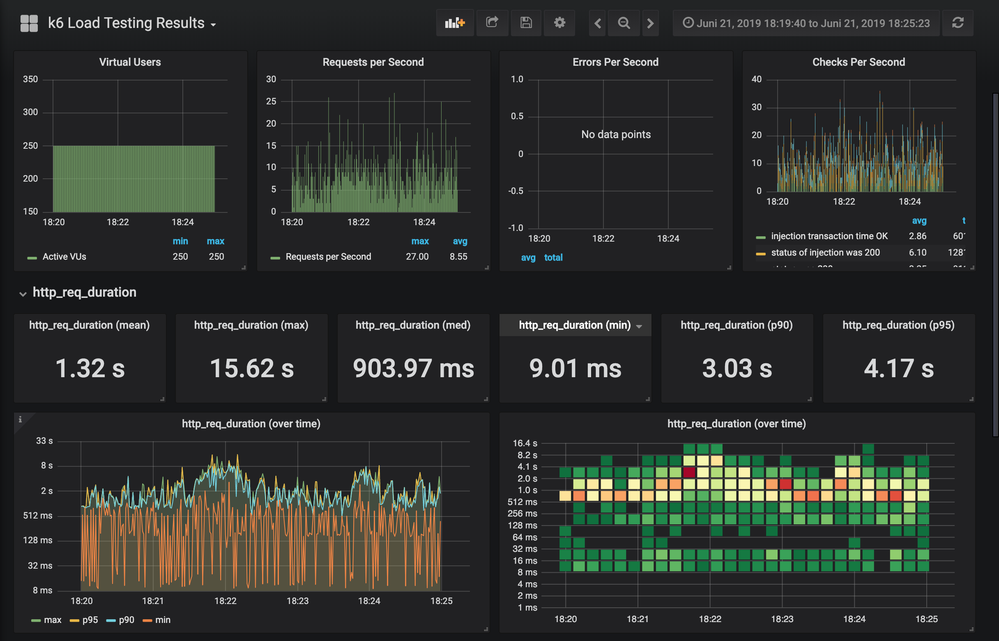

# Result test 2 (2019-06-21)
## Purpose
Find out the performance differences between CloudSql-Proxy and Private IP under load.

## Scenario
```
const vus = 250;
const average_sessions_duration_s = 150;
const max_response_time_ms = 670;
const test_duration_s = "300s";
```

Script: https://github.com/serlo/loadtests/blob/fe7a8e557f4de4ece54db3b3c1b7555f39ffa8bd/scripts/athene2.js

## Changes compared to previous tests
- Optimized resource limits
- More replicas for athene2 pod
- Changes in loadtest script: requests are now weight based and child-XMLHttpRequests are followed

## Hardware/Software setup
- Cloudflare Cache: no
- Varnish Cache:    no

### Cluster
- Database tier:    "db-n1-standard-4"
- Cluster instance type: "n1-highcpu-8"
- Node count: 2-10
- Autoscaling cluster: yes

### Apps/Pods
- Replicas athene2-app: 4
- Autoscaling athene2: no
- Resources httpd-container
 ````
  resources {
             limits {
               cpu    = "400m"
               memory = "500Mi"
             }
 
             requests {
               cpu    = "250m"
               memory = "200Mi"
             }
           }
 ````
- Resources php-container
````
  resources {
             limits {
               cpu    = "2000m"
               memory = "500Mi"
             }
 
             requests {
               cpu    = "250m"
               memory = "200Mi"
             }
           }
````
## Findings
**--> Performance with Private IP is much better**

CloudSql-Proxy run 1


CloudSql-Proxy run 2


Private IP run 1


Private IP run 2



