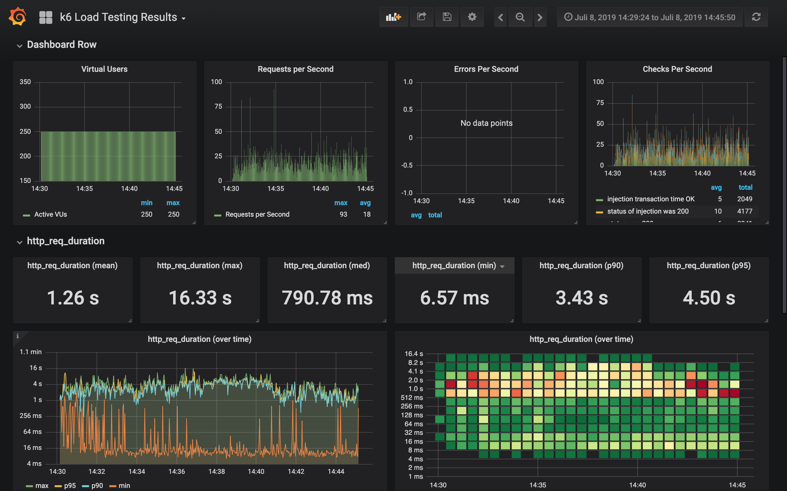
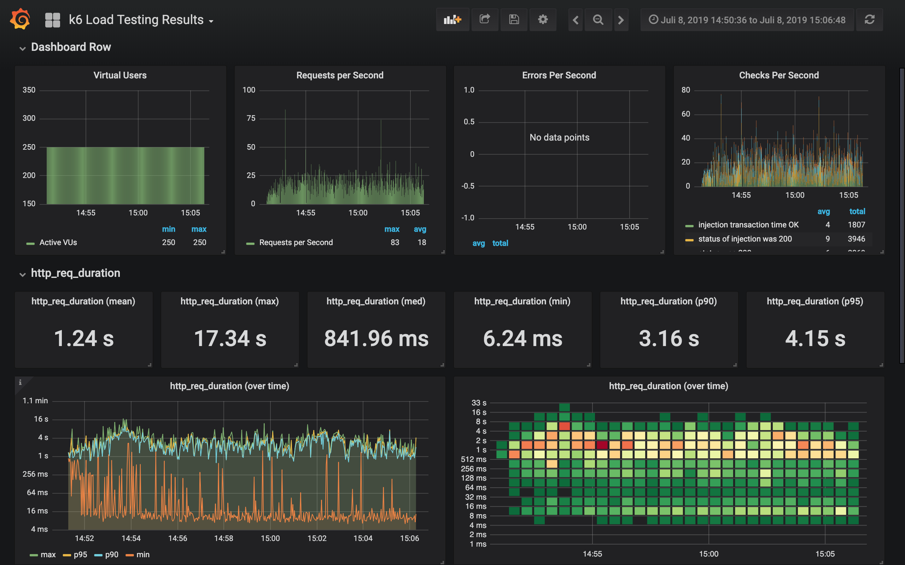
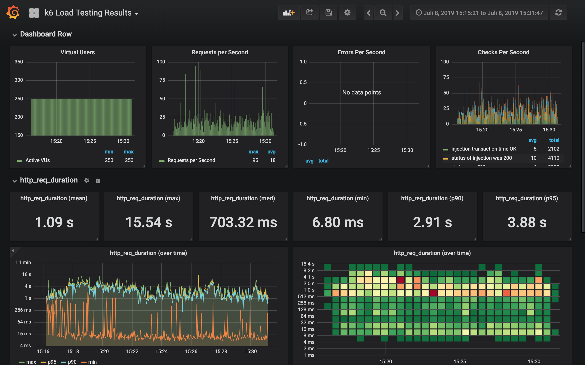
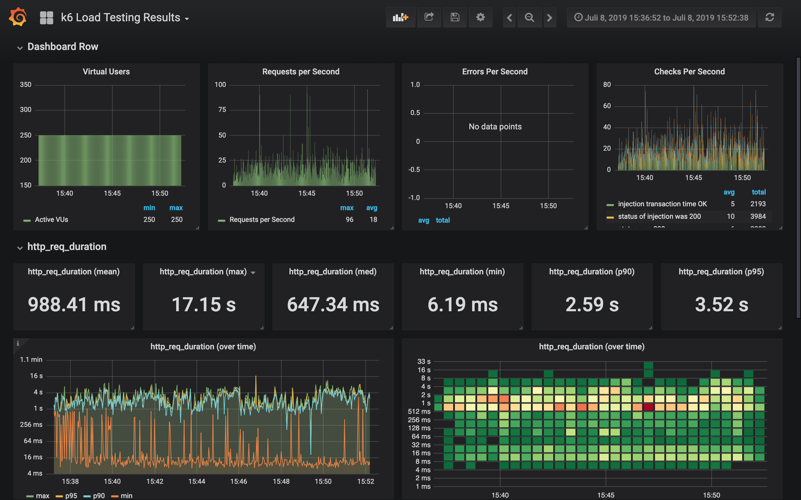
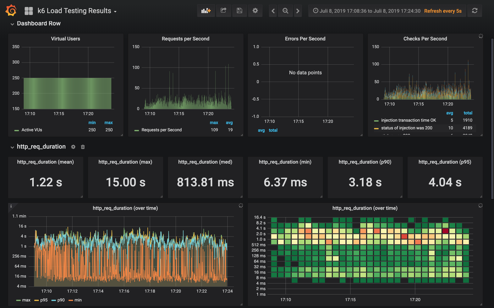
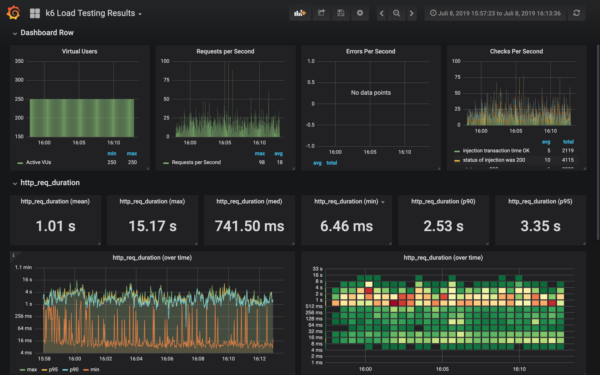
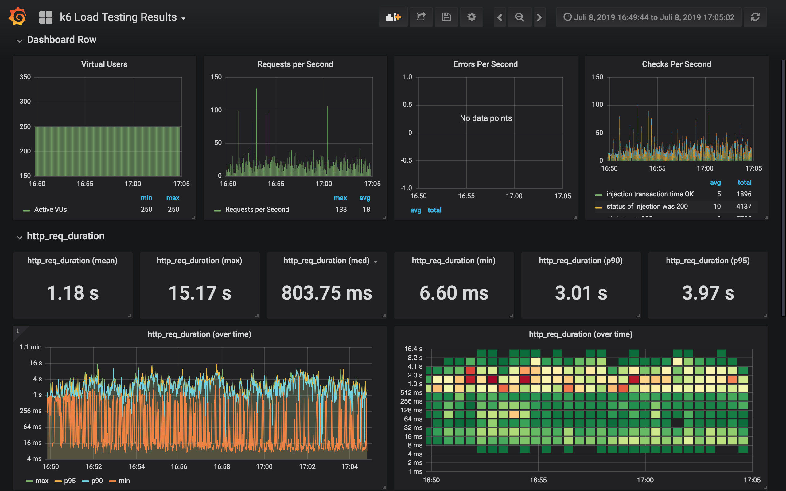

# Result test 3 (2019-07-08)
## Purpose
Compare performance with different replicas (1,2,4) for editor-renderer and legacy-editor-renderer.

After each test run, varnish cache and php cache (athene2) were emptied via new deployment.
Liveness probe was disabled. Manual "warmup" with GET /mathe site was done.

## Scenario
```
const vus = 250;
const average_sessions_duration_s = 150;
const max_response_time_ms = 670;
const test_duration_s = "900";
```

Script: https://github.com/serlo/loadtests/blob/fe7a8e557f4de4ece54db3b3c1b7555f39ffa8bd/scripts/athene2.js

Infrastructure: https://github.com/serlo/infrastructure/tree/282f7fee5429b7eb1d5107f906472c45e5c16bc5 (liveness probe of athene2 disabled)

## Changes compared to previous tests
- Varnish integrated

## Hardware/Software setup
- Cloudflare Cache: no (there is no caching through cloudflare in legacy prod system)
- Varnish Cache: yes

### Cluster
- Database tier:    "db-n1-standard-4"
- Cluster instance type: "n1-highcpu-8"
- Node count: 2-10
- Autoscaling cluster: yes

### Apps/Pods
- Replicas athene2-app: 4
- Replicas varnish: 1
- Replicas editor-renderer: 1,2,4
- Replicas legacy-editor-renderer: 1,2,4
- Autoscaling athene2: no
- Resources athene2-httpd-container
 ````
  resources {
             limits {
               cpu    = "400m"
               memory = "500Mi"
             }
 
             requests {
               cpu    = "250m"
               memory = "200Mi"
             }
           }
 ````
- Resources athene2-php-container
````
  resources {
             limits {
               cpu    = "2000m"
               memory = "500Mi"
             }
 
             requests {
               cpu    = "250m"
               memory = "200Mi"
             }
           }
````
- Resources varnish (malloc, 1G)
````
  resources {
             limits {
               cpu    = "100m"
               memory = "1200Mi"
             }
 
             requests {
               cpu    = "100m"
               memory = "1200Mi"
             }
           }
````
## Findings
**there is no clear winner --> current settings with replicas 2 is OK**

Run 1 - Replicas editor-renderer: 1, legacy-editor-renderer: 1


Run 2 - Replicas editor-renderer: 1, legacy-editor-renderer: 1 (rerun)


Run 3 - Replicas editor-renderer: 2, legacy-editor-renderer: 2


Run 4 - Replicas editor-renderer: 2, legacy-editor-renderer: 2 (rerun1)


Run 5 - Replicas editor-renderer: 2, legacy-editor-renderer: 2 (rerun2)


Run 6 - Replicas editor-renderer: 4, legacy-editor-renderer: 4


Run 7 - Replicas editor-renderer: 4, legacy-editor-renderer: 4 (rerun)



