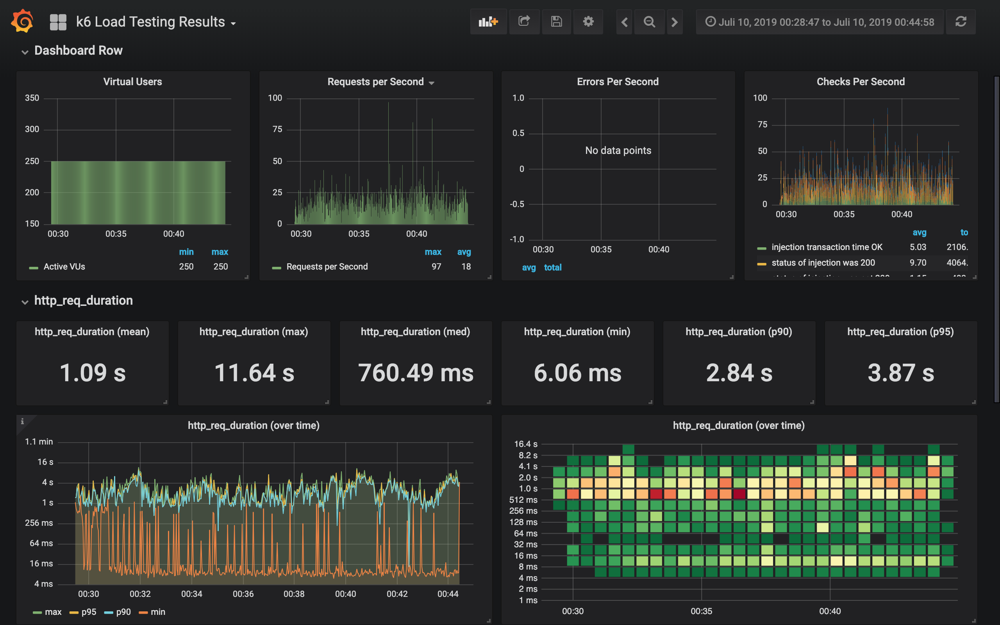
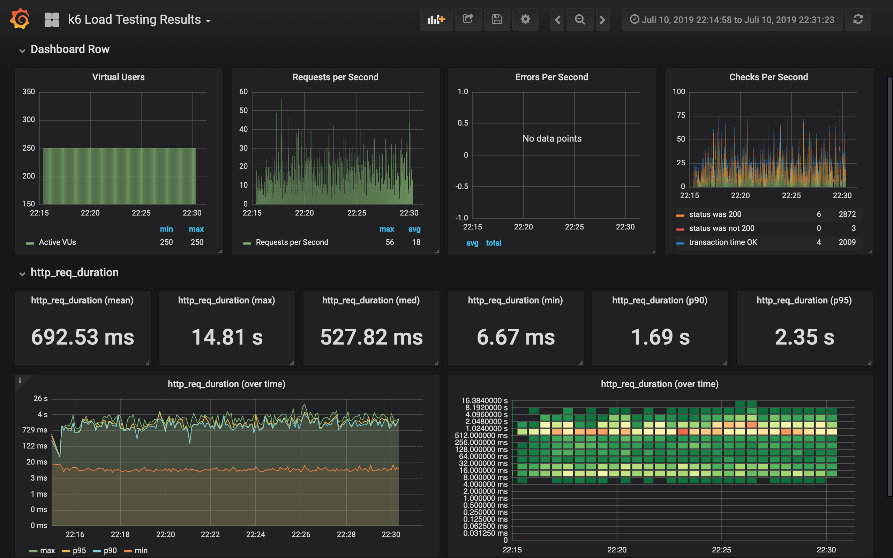
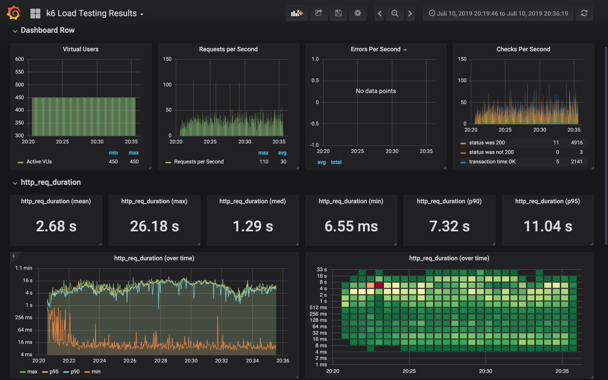
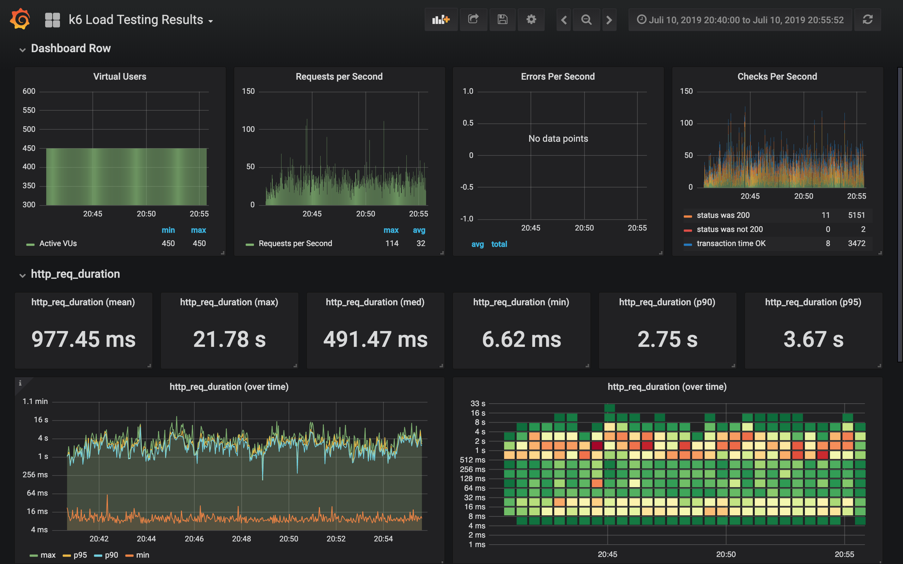
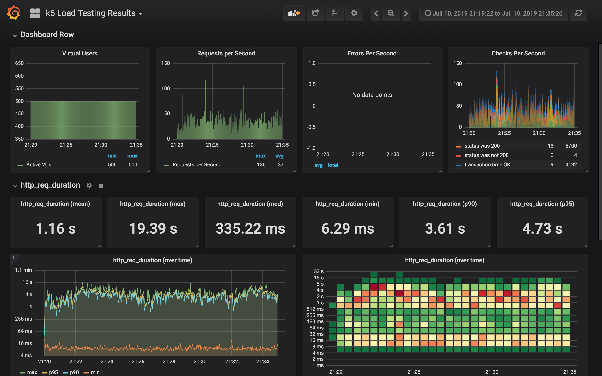
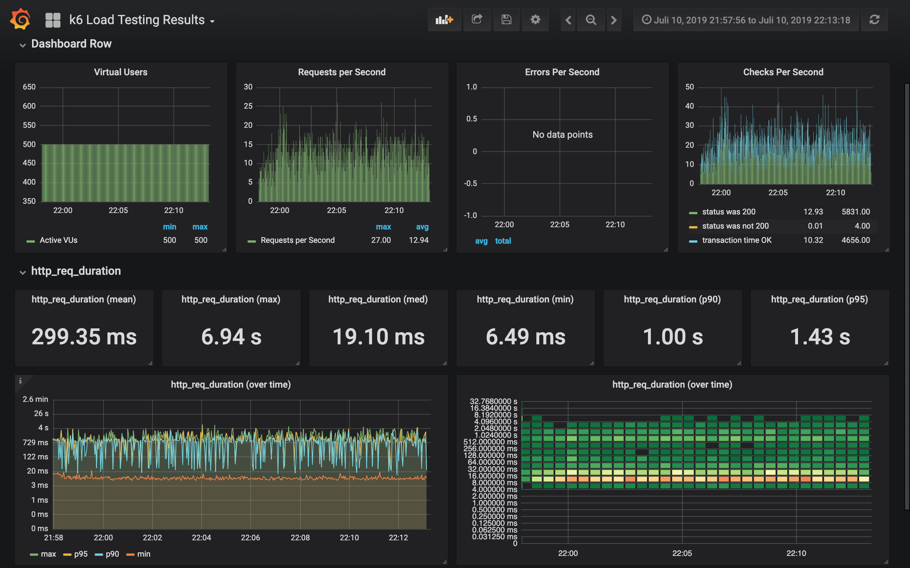

# Result test 4 (2019-07-10)
## Purpose
Test system performance under load with integrated varnish.

We ran different scenarios:

- run 1: 250 VUs, varnish cache empty
- run 2: 250 VUs, varnish cache not empty
- run 3: 450 VUs, varnish cache empty
- run 4: 450 VUs, varnish cache not empty
- run 5: 500 VUs, varnish cache not empty
- run 6: 500 VUs, varnish cache not empty, no XMLHttpRequests

## Scenario
```
const vus = 250; // const vus = 450; // const vus = 500;
const average_sessions_duration_s = 150;
const max_response_time_ms = 670;
const test_duration_s = "900";
```

Script: https://github.com/serlo/loadtests/blob/fe7a8e557f4de4ece54db3b3c1b7555f39ffa8bd/scripts/athene2.js

Infrastructure: https://github.com/serlo/infrastructure/tree/64db56c4fa3bb2ce10f6a5e60bc63581d1965ab8

## Changes compared to previous tests
- Varnish integrated

## Hardware/Software setup
- Cloudflare Cache: no (there is no caching through cloudflare in legacy prod system)
- Varnish Cache: yes

### Cluster
- Database tier:    "db-n1-standard-4"
- Cluster instance type: "n1-highcpu-8"
- Node count: 2-10
- Autoscaling cluster: yes

### Apps/Pods
- Replicas athene2-app: 5
- Replicas varnish: 1
- Replicas editor-renderer: 2
- Replicas legacy-editor-renderer: 2
- Autoscaling athene2: no
- Resources athene2-httpd-container
 ````
  resources {
             limits {
               cpu    = "400m"
               memory = "500Mi"
             }
 
             requests {
               cpu    = "250m"
               memory = "200Mi"
             }
           }
 ````
- Resources athene2-php-container
````
  resources {
             limits {
               cpu    = "2000m"
               memory = "500Mi"
             }
 
             requests {
               cpu    = "250m"
               memory = "200Mi"
             }
           }
````
- Resources varnish (malloc, 1G)
````
  resources {
             limits {
               cpu    = "100m"
               memory = "1200Mi"
             }
 
             requests {
               cpu    = "100m"
               memory = "1200Mi"
             }
           }
````
## Findings
- We reach circa average response time of legacy production system of 670ms (run 2)
- We definitely need filled varnish cache (run 1 vs 2, run 3 vs 4)
- Even with 450 and 500 VUs nearly all requests have a 200 HTTP status code (run 4, run 5)
- XMLHttpRequests are not cached through varnish, may we should consider caching these more (run 6)


run 1: 250 VUs, varnish cache empty


run 2: 250 VUs, varnish cache not empty


run 3: 450 VUs, varnish cache empty


run 4: 450 VUs, varnish cache not empty


run 5: 500 VUs, varnish cache not empty


run 6: 500 VUs, varnish cache not empty, no XMLHttpRequests



